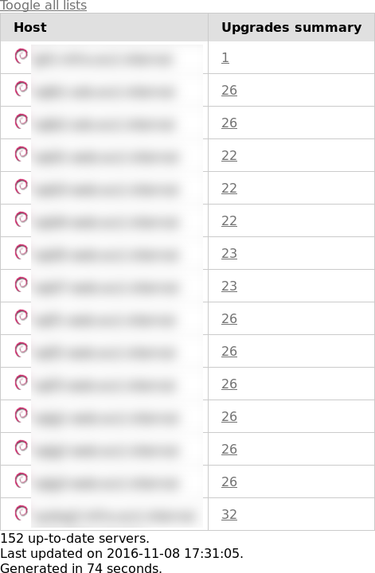
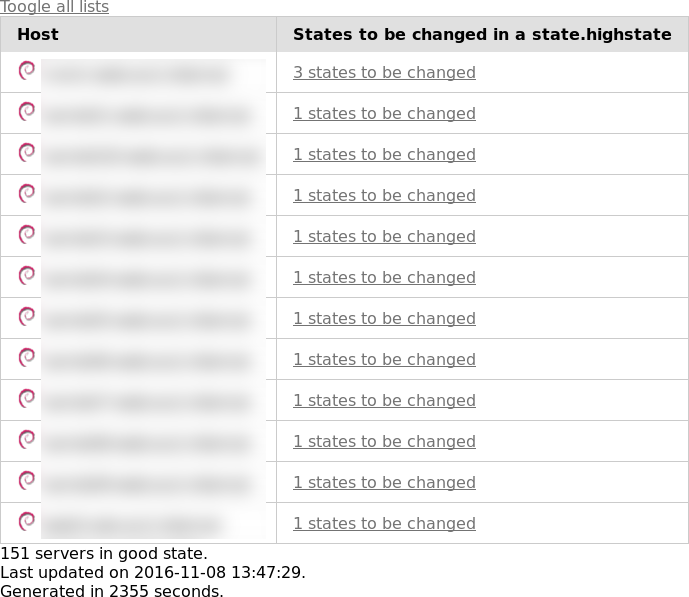
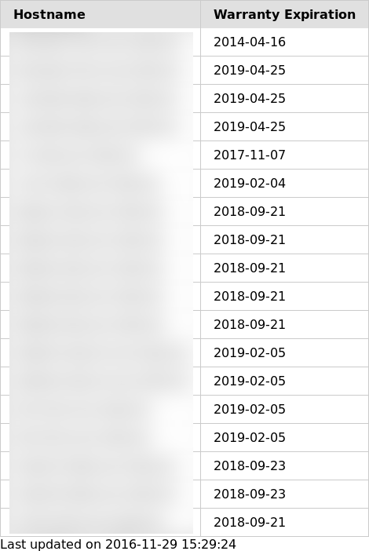

# Pepperboard

Pepperboard is a simple and modular dashboard toolkit for SaltStack. It also permits you to create your own dashboards.

For now, it needs to be run directly on the salt-master server

#### Index
1. [Installation](#installation)
2. [Usage](#usage)
3. [Dashboards](#dashboards)
4. [Screenshots](#screenshots)
5. [Development](#development)
6. [TODO](#todo)
7. [Licence and copyright](#licence-and-copyright)

# Installation
## Dependencies
  * Python modules :
    * futures
    * psutil
    * salt
  * External tools :
    * salt-master (needs to be run on the salt master)
  * Using Debian Jessie (with Backports enabled) :
    ```
    aptitude install python-psutil python-concurrent.futures
    ```
  * If you want to use psutil from the pip package, simply install the python-dev package.

## Installation
First, install the dependencies given in the dependencies section.

Then you have 3 ways to install Pepperboard (all using the root user) :

Using pip :
```
pip install pepperboard
```
From the upstream repository :
```
pip install git+https://github.com/webedia-dev/pepperboard.git
```
From a copy of the upstream repository :
```
git clone https://github.com/webedia-dev/pepperboard.git
cd pepperboard
python setup.py install
```

# Usage
  * It needs to be run locally on the Salt Master server.
  * It's preferable to run pepperboard as the root user, because it needs rights on the salt-master.
    * If you don't want it, here is the rights list you need to allow on the user for each dashboard :
      * dashboard highstates : state.highstate
      * dashboard upgrades : pkg.list_upgrades
      * dashboard mgrains : grains.items
    * Something like that in the master configuration should do the trick :
    ```
    client_acl:
      __username__:
        - state.highstate
        - pkg.list_upgrades
        - grains.items
    ```
    * It also need the right to write the output files.
  * Simple list of available arguments :
    * --help|-h : Prints an awesome help message
    * --output=|-o : comma separated values of files to write dashboards given with the "-d" argument.
    * --dashboards=|-d : comma separated values of dashboards.
    * --threads=|-t : comma separated values of threads count to be used (must be greater than 0). Prefix the number by "f" if you want more threads than CPU cores count.
    * --grains=|-g : comma separated values of grains to be used with the mgrains dashboard. This argument implies "-d 'mgrains'".
    * --dellapikey=|-a : Dell API key used by the dellwarranty dashboard. This argument implies "-d 'mgrains'".
    * --list|-l : List available dashboards.
  * List available dashboards :```pepperboard -l```
    * Example output :
    ```
    dellwarranty
    highstates
    upgrades
    mgrains
    ```
  * Generate 1 dashboard using default threads count : ```pepperboard -d 'upgrades' -o '/var/www/upgrades.html'```
  * -o and -d arguments are CSV list, if you want multiples dashboards, simply separate them using a comma :```pepperboard -d 'upgrades,highstates' -o '/var/www/upgrades.html,/var/www/highstates.html'```
    * In this example, the upgrades dashboard will be written in /var/www/upgrades.html and the highstates dashboard will be written in /var/www/highstates.html.
  * Optional arguments
    * --threads|-t : Specify thread count for dashboards (must be greater than 0), it's a list, the same as -o and -d arguments.
      * If you want to use more threads than CPU cores, add "f" before the thread count.
        * Example : "f32" will force the dashboard to be generated using 32 threads even though the CPU hasn't enough CPU cores.
    * --grains|-g : Specify the grains to be included in the mgrains dashboard.
      * Example : ```pepperboard -d 'upgrades,highstates,mgrains' -o '/var/www/upgrades.html,/var/www/highstates.html,/var/www/customgrains.html' -g 'manufacturer,productname,serialnumber'```
      * When this argument is specified we can omit "mgrains" in the dashboard list.
    * --dellapikey|-a : Specify the Dell API key to be used with the dellwarranty dashboard.
      * Example : ```pepperboard -o '/var/www/dellwarranty.html' -t '4' -a '__dell_api_key__'```
      * When this argument is specified we can omit "dellwarranty" in the dashboard list.
  * Exemple of crontab (in /etc/crontab) :
    * ```30 1   * * *	root	pepperboard -d 'upgrades,highstates' -o '/var/www/dash_upgrades.html,/var/www/dash_highstates.html' -t 'f8,4'```

# Dashboards
  * dellwarranty : Displays the warranty of all minions that are Dell servers
    * You need to request a API key from Dell to use this dashboard
  * upgrades : Displays a list of upgradable packages for each minion (equivalent to "salt '*' pkg.list_upgrades")
  * highstates : Displays a list of unsynchronised states for each minion (equivalent to "salt '*' state.highstate test=True)
  * mgrains : Displays a list of grains for each minion

# Screenshots
  * upgrades dashboard (using ```pepperboard -d 'upgrades' -o '/var/www/dash_upgrades.html' -t 'f8'```) : 

    
  * Highstates dashboard (using ```pepperboard -d 'highstates' -o '/var/www/dash_highstates.html' -t '4'```):
  
    
  * Mgrains dashboard (using ```pepperboard -o '/var/www/dash_mgrains.html' -t 'f32' -g 'server_id,shell,num_cpus,num_gpus'```)

    
  * Dellwarranty dashboard (using ```pepperboard -o '/var/www/dellwarranty.html' -t '4' -a '__dell_api_key__'```
  
    

# Development
  * Create a new dashboard : Simply add a new python script in the dashboard package
  * It needs to have one of these functions (in this priority order) :
    * gendata(input, nthreads) : Only returns a dictionnary containing these fields, the HTML and everything related to the dashboard design is not managed by this function :
      * Arguments :
        * input (mixed or None) : Can be one of the following
            * List of inputs to be used in the dashboard (like the grains list in mgrains dashboard)
            * None : Set it to None if you want to manage the input directly in the gendata function
        * nthreads (int or None) : Threads count for generating the dashboard
            * Can be set to None for either using the default thread count or not using threads at all.
      * It returns a dictionnary with the following keys (all mandatory)  :
        * ncol : Columns count for the dashboard (int type)
        * headers : List of headers (list type)
        * data : Dictionnary containing the content of the dashboard (dict type)
            * In case you have 1 data column (ncol == 2) :
                * This dictionnary only contains string type values.
            * In case you have more than 1 data column (ncol > 2) :
                * This dictionnary contains 1 dictionnary per table line with the key being the first column header.
    * gendash(output, nthreads) : Generates the complete dashboard.
      * Arguments :
        * output (str) : Absolute path of the output file.
        * nthreads (int or None) : Threads count for generating the dashboard
            * Can be set to None for either using the default thread count or not using threads at all.

# TODO
  * Fix this README file and general documentation.
  * Use pepper to use salt-api.
  * Get the OS logos from PNG/JPG files instead of having base64 directly in python code.
  * Make the dashboard list a little bit prettier.

# Licence and copyright


Copyright 2016 Cyril Lavier <cyril.lavier@webedia-group.com> - <cyril.lavier@davromaniak.eu>


Licensed under the Apache License, Version 2.0 (the "License");
you may not use this file except in compliance with the License.
You may obtain a copy of the License at

  http://www.apache.org/licenses/LICENSE-2.0

Unless required by applicable law or agreed to in writing, software
distributed under the License is distributed on an "AS IS" BASIS,
WITHOUT WARRANTIES OR CONDITIONS OF ANY KIND, either express or implied.
See the License for the specific language governing permissions and
limitations under the License.